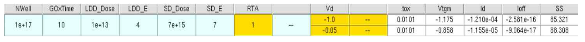

# TCAD PMOS Process Optimization

기존 NMOS 공정 예제를 **PMOS 구조와 바이어스 조건으로 변환**하고, LDD와 Source/Drain 이온주입 조건 및 열처리 변수를 단계적으로 비교한 Sentaurus TCAD 프로젝트입니다.

구동 전류, 누설 전류, Subthreshold Swing(SS)을 함께 고려해 평가한 조건 중 최종 후보를 선정했습니다.

**Summary:**  
This project converts an NMOS process example to PMOS and compares implantation and annealing conditions using Sentaurus TCAD, with drive current, leakage current, and subthreshold swing used as the main evaluation metrics.

---

## Results at a Glance

| Item | Final Result |
|---|---:|
| LDD | `1e13 cm^-2`, 4 keV |
| Source/Drain | `7e15 cm^-2`, 7 keV |
| RTA variable | 1 |
| Anneal temperature | 1000 °C |
| abs(Id) at Vd = -1.0 V | `1.210e-04 A/µm` |
| abs(Ioff) at Vd = -1.0 V | `2.581e-16 A/µm` |
| SS | 85.321 mV/dec |
| Vtgm | -1.175 V |



*Figure. 보고서 최종 조건표와 전기적 결과.*

---

## What Was Implemented

- Boron 기반 body 조건을 Phosphorus 기반 N-type body 조건으로 변경
- LDD 및 Source/Drain implant를 BF₂ 기반 p-type implant로 변경
- PMOS 동작에 맞춰 gate/drain bias 방향을 음전압으로 변경
- LDD Dose → LDD Energy → S/D Dose → S/D Energy → RTA 순서로 조건 비교
- drive current, leakage current, SS를 함께 고려해 후보 선정
- 최종 PMOS 구조와 transfer curve 확인
- 12개 TDR checkpoint로 공정 구조 변화 확인

---

## Read the Project

| Page | Description |
|---|---|
| [Project Page](./index.md) | 프로젝트 목적, 구현 내용, 최종 결과를 한눈에 확인 |
| [Detailed Navigation](./guide/00_navigation.md) | 모든 과정 문서와 source 위치 안내 |
| [Project Overview](./guide/01_project_overview.md) | 문제 정의와 전체 흐름 |
| [nMOS-to-PMOS Conversion](./guide/02_nmos_to_pmos_conversion.md) | dopant와 bias 변경 이유 |
| [SProcess Implementation](./guide/03_sprocess_implementation.md) | implant와 anneal 설정 |
| [SDevice Bias Setup](./guide/04_sdevice_bias_setup.md) | PMOS bias와 transfer curve |
| [Process Flow Visualization](./guide/05_process_flow_visualization.md) | 12개 TDR 공정 단계 |
| [Process Optimization](./guide/06_process_optimization.md) | 단계별 조건 탐색 |
| [Final Results](./guide/07_final_results.md) | 최종 수치와 해석 |
| [Limitations](./guide/08_limitations_and_next_steps.md) | 재현성 한계와 개선 방향 |
| [Report Scope](./report/README.md) | 공개 범위와 원본 보고서 안내 |

---

## Source Code

| File | Description |
|---|---|
| [`source/sprocess/implant-anneal-excerpt.cmd`](./source/sprocess/implant-anneal-excerpt.cmd) | 보고서에서 확인 가능한 implant / spacer / anneal 핵심 command |
| [`source/sprocess/README.md`](./source/sprocess/README.md) | SProcess source 범위 |
| [`source/sdevice/README.md`](./source/sdevice/README.md) | SDevice bias 설정과 공개 범위 |
| [`source/svisual/README.md`](./source/svisual/README.md) | 결과 지표와 extraction code 공개 범위 |

> `source/`에는 현재 확인 가능한 원본 command만 정리했습니다. 전체 mesh, physics, electrode, solve block을 포함하는 완전한 simulation deck을 임의로 재구성하지 않았습니다.

---

## Repository Structure

```text
TCAD-PMOS-Process-Optimization/
├── README.md
├── index.md
├── _config.yml
├── guide/
│   ├── 00_navigation.md
│   ├── 01_project_overview.md
│   ├── 02_nmos_to_pmos_conversion.md
│   ├── 03_sprocess_implementation.md
│   ├── 04_sdevice_bias_setup.md
│   ├── 05_process_flow_visualization.md
│   ├── 06_process_optimization.md
│   ├── 07_final_results.md
│   └── 08_limitations_and_next_steps.md
├── figures/
│   ├── final-results.png
│   └── report-page-*.png
├── source/
│   ├── README.md
│   ├── sprocess/
│   ├── sdevice/
│   └── svisual/
├── results/
│   └── final_results.csv
└── report/
    └── README.md
```

---

## Project Scope

이 저장소는 2026년 4월 반도체집적공정 수업 중간 프로젝트의 결과를 포트폴리오 형태로 재구성한 것입니다. 수치와 이미지는 제출 보고서에서 확인했으며 시뮬레이션을 새로 실행해 만든 결과가 아닙니다.

순차 탐색으로 얻은 결과이므로 모든 변수 조합에 대한 global optimum으로 해석하지 않습니다.
