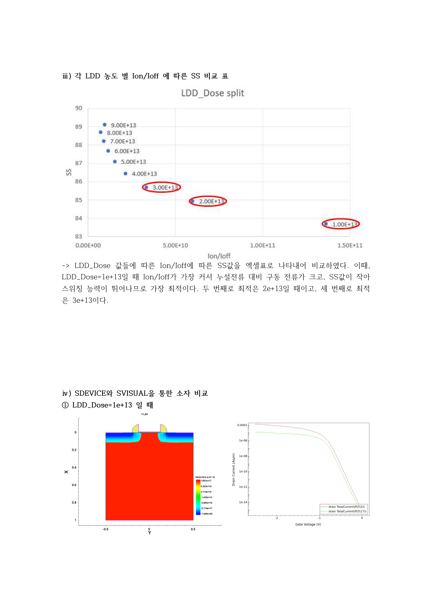
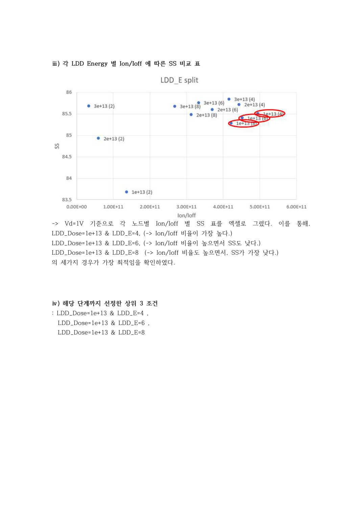
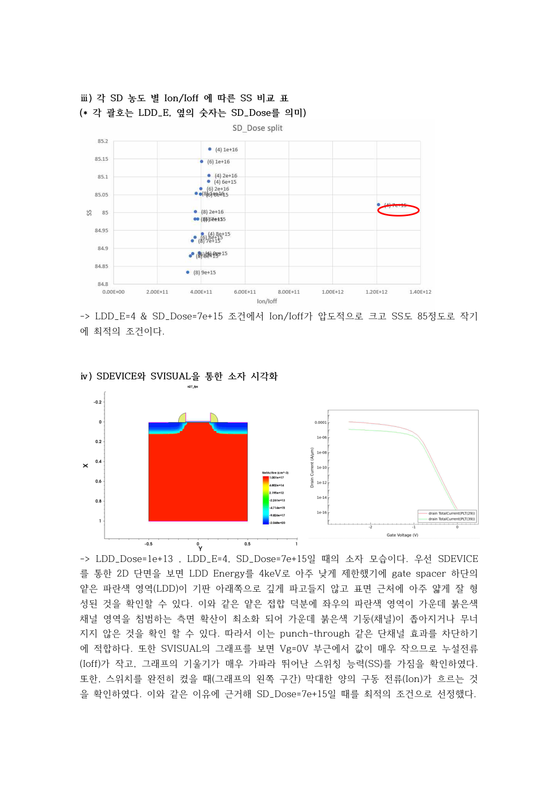
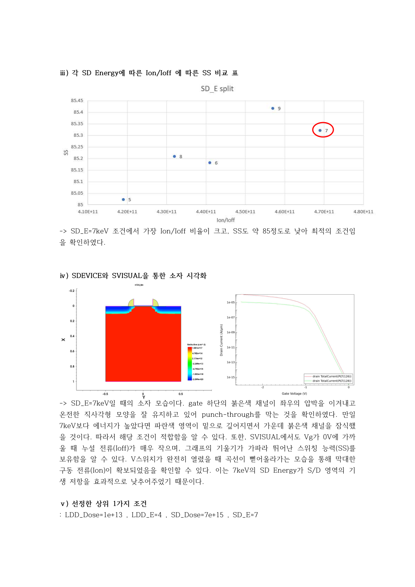
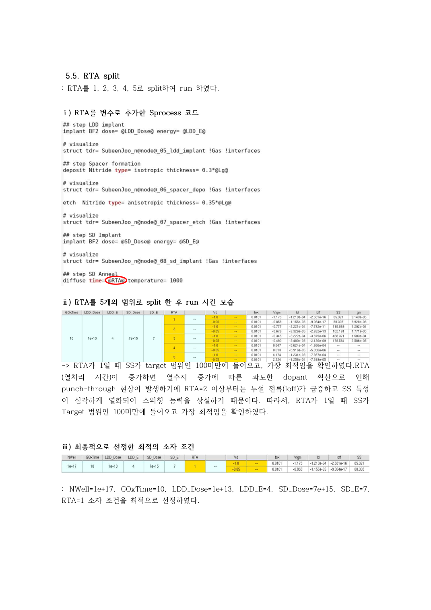

# 단계별 조건 탐색

## 1. LDD Dose (보고서 19~21쪽)

1e13~9e13 cm⁻²를 1e13 간격으로 비교했습니다. 이 단계의 고정값은 Lg=0.25, NWell=1e17, GOxTime=10, LDD_E=30, SD_Dose=1e15, SD_E=15, RTA=1입니다. 이후 에너지 탐색 범위와 이 초기 고정값을 혼동하지 않아야 합니다.

1e13의 Ion/Ioff 및 SS가 유리했으며, 다음 변수와의 조합을 고려해 2e13, 3e13도 후보로 유지했습니다.

## 2. LDD Energy (22~23쪽)

2, 4, 6, 8 keV를 비교한 뒤 LDD_Dose=1e13에서 에너지 4, 6, 8 keV 조건을 유지했습니다. 각 조건의 비율과 SS가 달라 후보를 하나로 즉시 좁히지 않았습니다.

## 3. S/D Dose (24~25쪽)

유지한 LDD 에너지 3개 조건에 대해 S/D Dose 6e15, 7e15, 8e15, 9e15, 1e16, 2e16 cm⁻²를 비교했습니다. LDD_E=4 keV, SD_Dose=7e15 cm⁻² 조합을 선정했습니다.

## 4. S/D Energy (26~27쪽)

5~9 keV를 1 keV 간격으로 비교했습니다. 7 keV에서 가장 높은 Ion/Ioff 비율을 보였고 SS도 목표 이내여서 선정했습니다. 그림상 5 keV의 SS는 더 작으므로 ‘7 keV에서 SS가 최소’라고 표현하지 않았습니다.

## 5. RTA (28쪽)

RTA 변수 1~5를 비교해 1을 선정했습니다. 표에서 |Vd|=1 V인 경우 RTA=2의 SS는 약 118.069 mV/dec로 목표를 벗어납니다. 긴 열처리에 따른 도핑 분포 변화가 원인일 수 있지만, 이 표만으로 punch-through를 확정하지는 않습니다. 시간 단위에 관한 제한은 결과 문서를 참조하세요.

