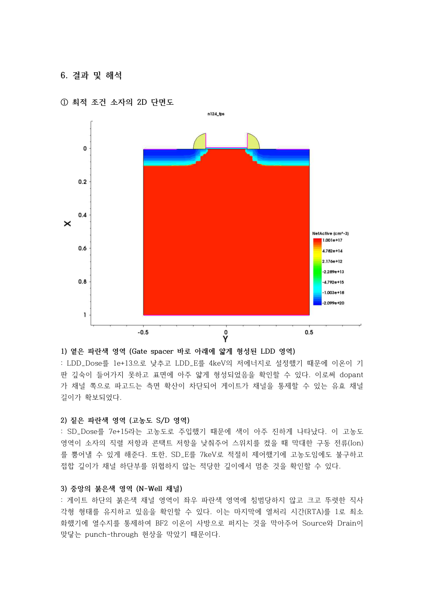
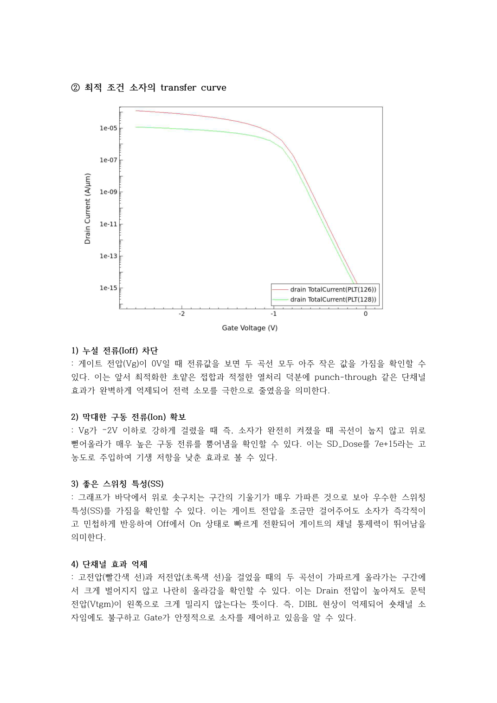

# 최종 결과와 해석 범위

## 보고서에서 확인한 수치

| Vd (V) | Vtgm (V) | Id (A/µm) | Ioff (A/µm) | SS (mV/dec) |
|---:|---:|---:|---:|---:|
| -1.00 | -1.175 | -1.210e-4 | -2.581e-16 | 85.321 |
| -0.05 | -0.858 | -1.155e-5 | -9.064e-17 | 88.308 |

출처: 보고서 28쪽 최종 조건표. 전류 부호는 원문 그대로 보존했습니다. CSV에도 부호와 절댓값을 별도로 기록했습니다. SS 단위는 지표에 맞춰 mV/dec로 정리했습니다.

## 구조와 transfer curve

낮은 LDD 주입량 및 에너지와 선택한 열처리 조건에서 낮은 누설 전류와 목표 이내의 SS가 나타났습니다. 고농도 S/D는 직렬저항을 줄이는 방향으로 작용할 수 있지만, 실제 저항값은 추출하지 않았으므로 감소율은 제시하지 않습니다.

## 해석과 재현성의 한계

1. **RTA 단위:** 본문은 1~5 s로 설명하지만 캡처 코드는 `diffuse time= @RTA@ temperature= 1000`으로 단위가 명시돼 있지 않습니다. 원본 입력 파일과 해당 도구의 시간 단위 규약 확인 전에는 ‘실제 1초 열처리’로 확정하지 않습니다.
2. **Drain 바이어스:** 일부 본문에 Vd=1 V라고 적혀 있으나 최종 표는 -1.0 V입니다. 결과 정리는 최종 표를 기준으로 했습니다.
3. **지표 추출:** 원본 SVisual 코드, 추출 구간, 전류 정규화와 면적 설정을 받지 못했습니다. 보고서에 정의된 Vg 지점과 실제 표의 추출 방식을 독립적으로 검증하지 못했습니다.
4. **SS와 속도:** SS는 게이트 전압에 대한 전류 변화율 지표입니다. 작은 SS를 시간 응답이나 동작 주파수의 직접 측정값으로 해석하지 않습니다.
5. **DIBL 및 punch-through:** 구조 그림과 transfer curve만으로 ‘완전히 억제’됐다고 단정하지 않습니다. 특히 표의 두 Vtgm 차이가 0.317 V이므로 추출 방식 검증 없이 DIBL이 작다고 주장하지 않습니다.
6. **최적화 범위:** 단계별 후보 축소를 사용했으며 모든 변수의 전 조합을 평가하지 않았습니다. 공정 오차, 온도 변화 및 통계적 변동 검증은 보고서에서 확인되지 않습니다.
7. **개선율:** 일관된 PMOS 기준 소자와의 전후 지표가 확보되지 않아 ‘성능 몇 % 향상’ 수치를 만들지 않았습니다. 앞부분 NMOS 실습 결과를 PMOS 비교 기준으로 사용하지 않았습니다.
8. **수치적 바닥:** 매우 작은 Ioff는 물리 모델과 수렴 설정의 영향을 받을 수 있습니다. 모델 설정과 로그 없이 실측 누설 성능으로 일반화하지 않습니다.
9. **완전한 실행 파일:** 현재 코드는 보고서 캡처의 부분 발췌입니다. 전체 mesh, 공정 레시피, electrode, physics, solve block 및 추출 코드가 필요합니다.

이 문서의 목표는 당시 수행 결과를 보존하면서 관측 결과와 물리적 해석을 구분하는 것입니다.
