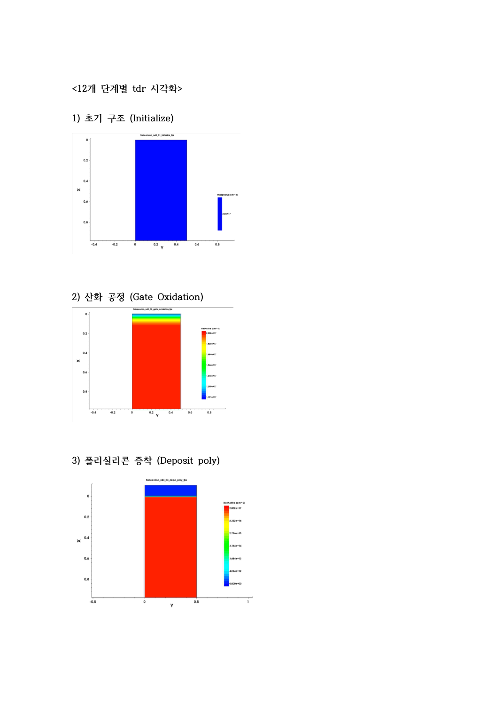
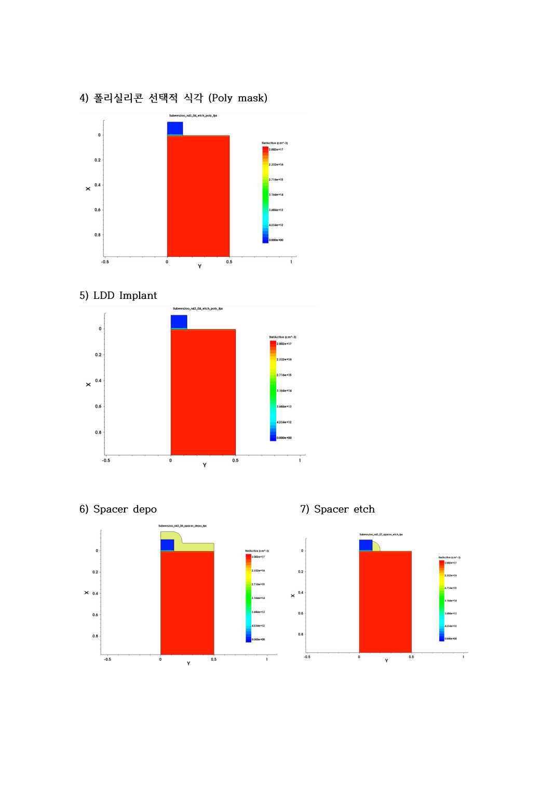
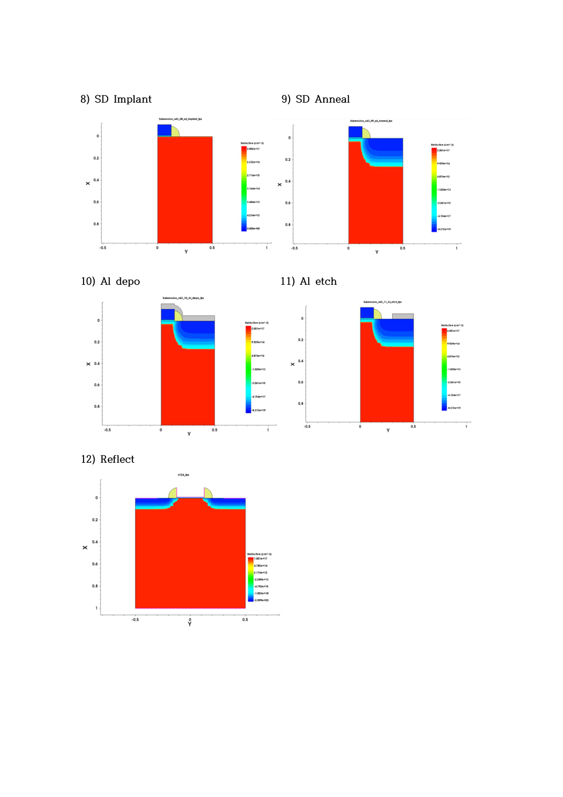

# 12단계 공정 시각화

보고서 31~33쪽의 TDR 시각화 기록입니다.

| 순서 | 단계 |
|---|---|
| 1 | Initialize |
| 2 | Gate oxidation |
| 3 | Polysilicon deposition |
| 4 | Poly mask / etch |
| 5 | LDD implantation |
| 6 | Spacer deposition |
| 7 | Spacer etch |
| 8 | S/D implantation |
| 9 | S/D anneal |
| 10 | Al deposition |
| 11 | Al etch |
| 12 | Reflect |

